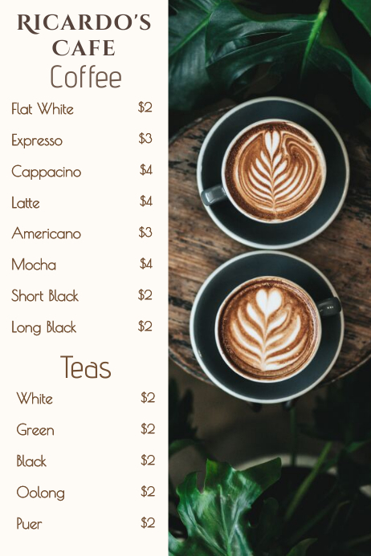
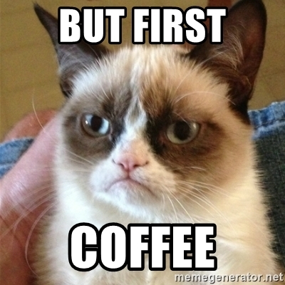

# CoffeeMachine
  
programme Java permettant de : 
 - Prendre la commande du client (café, lait chaud, chocolat...).  
 - Prendre l'argent inséré par le client.  
 - Vérifier la disponibilité de la commande et est ce que l'argent inséré est suffisant ?  
 - Rendre la monnaie ou cas où il y a du reste.  
 - Afficher un message (Take Your order &amp; welcome to the Java class).
  